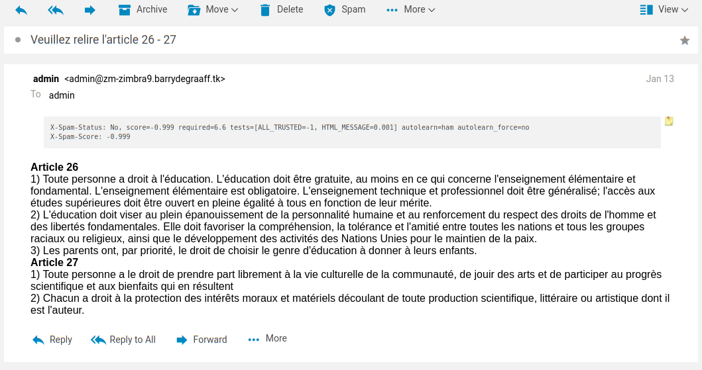

# X-Spam Zimlet

The X-Spam Zimlet displays the X-Spam-Status and X-Spam-Score headers from emails in the UI. 

## Zimbra API JS Client

This guides introduces the @zimbra/api-client a GraphQL client for making requests against the Zimbra SOAP API.


## Screenshots

> 
*The X-Spam Zimlet.*

## Using @zimbra/api-client

This code snippet shows how to make a GetMsg SOAP request to get access to headers from the email:

```javascript
import { createElement, Component, render } from 'preact';
import { withIntl } from '../../enhancers';
import { withText } from 'preact-i18n';
import style from './style';

@withIntl()
@withText({
    title: 'xspam-zimlet.title'
})

export default class MoreMenu extends Component {
    constructor(props) {
        super(props);
        this.zimletContext = props.children.context;
        const { zimbraBatchClient } = this.zimletContext;
        console.log(this);
        zimbraBatchClient.jsonRequest({
            name: 'GetMsg',
            namespace: "urn:zimbraMail",
            body: {
                m: { id: this.props.emailData.id, header: [{ n: "X-Spam-Status" }, { n: "X-Spam-Score" }] }
            }
        })
            .then(response => {
                try {
                    console.log(response);
                    console.log(zimbraBatchClient.normalizeMessage(response.m[0]));

                    window.parent.document.getElementById('XSpamZimlet').innerText = 'X-Spam-Status: ' + response.m[0]._attrs['X-Spam-Status'].replace(/\n|\r/g, "") + '\r\nX-Spam-Score: ' + response.m[0]._attrs['X-Spam-Score'].replace(/\n|\r/g, "");
                } catch (err) { }
            });
    }

    render() { return (<div class={style.XSpamZimlet} id="XSpamZimlet"></div>) }
}
```

## Further reading

- https://files.zimbra.com/docs/soap_api/9.0.0/api-reference/index.html
- https://files.zimbra.com/docs/soap_api/9.0.0/api-reference/zimbraMail/GetMsg.html
